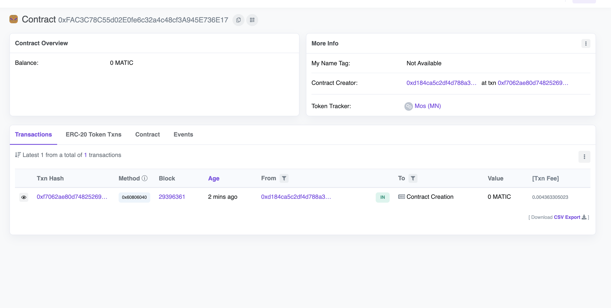

# Simple NFT

This is a simple NFT token built using hardhat and ethers.js, it is deployed to the polygon mumbai testnet.



To run this code, you need to 


- create a .env file in the hardhat folder and run 
  ```shell
  npm install dotenv
  ```
- then create the variables as listed below and add your RPC URL and private key to a polygon mumbai testnet. Make sure you have some polygon test tokens in the account
  ```shell
  ALCHEMY_HTTP_URL=""
  PRIVATE_KEY=""
  ```


